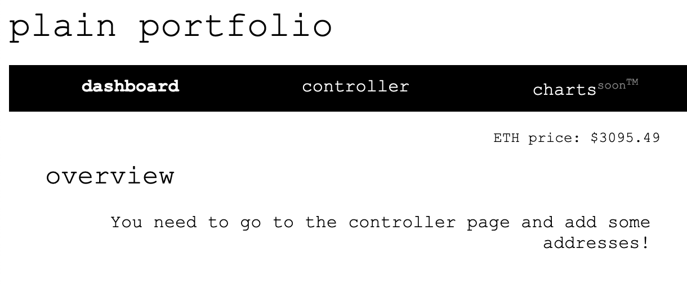
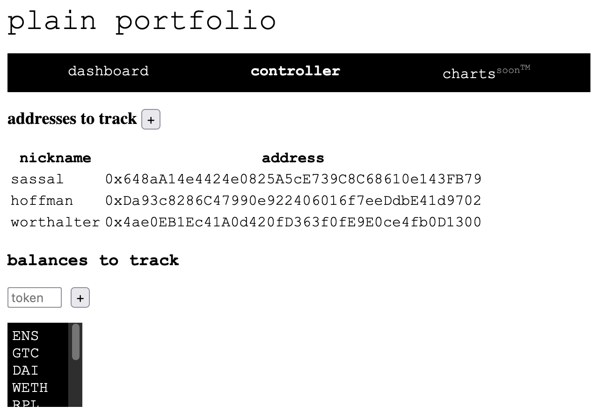
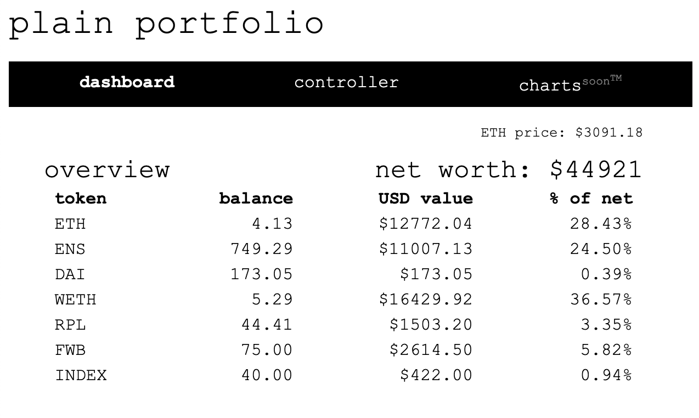

## project description:
simple on-chain portfolio viewer

## tech stack:
html, css, javascript, node.js

## features:
- add unlimited addresses to your controller
- add tokens to track
- view aggregated token balances across all accounts
- view all balances in USD
- view net worth in USD
- view each token's total value percentage as part of your net worth

## screenshots:

------------
------------

------------
------------
